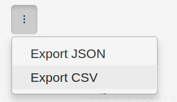

# Table of Contents
* [What is Kubernetes Opex Analytics](#what-is-koa)
  * [Goals](#goals)
  * [Concepts](#concepts)
  * [Cost Models](#cost-models)
  * [Screenshots](#screenshorts)
* [Getting Started](#getting-started)
  * [Kubernetes API Access](#kubernetes-api-access)
  * [Configuration Variables](#config-variables)
  * [Deployment on Docker](#start-koa-on-docker)
  * [Deployment on Kubernetes Cluster](#start-koa-on-k8s)
  * [Prometheus Exporter](#prometheus-exporter)
  * [Grafana Dashboard](#grafana-dashboard)
  * [Export Datasets](#export-datasets)
* [License & Copyrights](#license-copyrights)
* [Support & Contributions](#contributions)

# <a name="what-is-koa"></a>What is Kubernetes Opex Analytics

## <a name="goals"></a>Goals
Kubernetes Opex Analytics provides short-, mid- and long-term resource usage dashboards over Kubernetes clusters so to allow organizations to understand how their Kubernetes operating costs are spending by their different projects. The final **goal being to help them make cost allocatoion and capacity planning decisions** with factual analytics.

To meet this goal, Kubernetes Opex Analytics collects CPU and memory usage metrics from Kubernetes's metrics APIs, processes and consolidates them over time to produce resource usage analytics on the basis of namespaces and with different time aggregation perspectives that cover up to a year. These perspectives also show a special usage item labelled _non-allocatable_ highlighting the **share of non-allocatable capacity** for both CPU and memory.


## <a name="concepts"></a>Concepts
Kubernetes Opex Analytics enables the following core concepts and features:

* **Namespace-focused:** Means that consolidated resource usage metrics consider individual namespaces as fundamental units for resource sharing. A special care is taken to also account and highlight non-allocatable resources .
* **Hourly Usage & Trends:** Like on public clouds, resource use for each namespace is consolidated on a hourly-basic. This actually corresponds to the ratio (%) of resource used per namespace during each hour. It's the foundation for cost calculation and also allows to get over time trends about resources being consuming per namespace and also at the Kubernetes cluster scale.
* **Daily and Monthly Usage Costs:** Provides for each period (daily/monthly), namespace, and resource type (CPU/memory), consolidated cost computed given one of the following ways: (i) accumulated hourly usage over the period; (ii) actual costs computed based on resource usage and a given hourly billing rate; (iii) normalized ratio of usage per namespace compared against the global cluster usage.
* **Occupation of Nodes by Namespaced Pods:** Highlights for each node the share of resources used by active pods labelled by their namespace.
* **Efficient Visualization:** For metrics generated, Kubernetes Opex Analytics provides dashboards with relevant charts covering as well the last couple of hours than the last 12 months (i.e. year). For this there are **built-in charts**, a **Prometheus Exporter** along with **Grafana Dashboard** that all work out of the box. 


## <a name="cost-models"></a>Cost Models
Cost allocation models can be set through the startup configuration variable `KOA_COST_MODEL`. Possible values are:

* `CUMULATIVE_RATIO`: (default value) compute costs as cumulative resource usage for each period of time (daily, monthly).
* `RATIO`: compute costs as normalized ratios (`%`) of resource usage during each period of time. 
* `CHARGE_BACK`: compute actual costs using a given cluster hourly rate and the cumulative resource usage during each period of time.

Refer to the [Configuration](#config-variables) section for more details.

## <a name="screenshorts"></a>Screenshorts
You can find below screenshorts of built-in charts.

### Last Week Hourly Resource Usage Trends


### Two-weeks Daily CPU and Memory Usage


### One-year Monthly CPU and Memory Usage


### Last Nodes' Occupation by Pods


### Grafana Dashboard (works with Prometheus Exporter) 


## <a name="getting-started"></a>Getting Started

## <a name="kubernetes-api-access"></a>Kubernetes API Access
Kubernetes Opex Analytics needs read-only access to the following Kubernetes APIs. 

* /apis/metrics.k8s.io/v1beta1
* /api/v1

You need to provide the base URL of the Kubernetes API when starting the program (see example below). 

Typically if you're planning an installation inside a Kubernetes cluster, you can connect to the local cluster API endpoint at: `https://kubernetes.default`.

Likewise if you're planning an installation outside a Kubernetes cluster you can use a proxied access to Kubernetes API as follows:

```
$ kubectl proxy
```

This will open a proxied access to Kubernetes API at `http://127.0.0.1:8001`.

## <a name="config-variables"></a>Configuration Variables
Kubernetes Opex Analytics supports the following environment variables when it starts:
* `KOA_DB_LOCATION` sets the path to use to store internal data. Typically when you consider to set a volume to store those data, you should also take care to set this path to belong to the mounting point.
* `KOA_K8S_API_ENDPOINT` sets the endpoint to the Kubernetes API.
* `KOA_COST_MODEL` (version >= `0.2.0`): sets the model of cost allocation to use. Possible values are: _CUMULATIVE_RATIO_ (default) indicates to compute cost as cumulative resource usage for each period of time (daily, monthly); _CHARGE_BACK_ calculates cost based on a given cluster hourly rate (see `KOA_BILLING_HOURLY_RATE`); _RATIO_ indicates to compute cost as a normalized percentage of resource usage during each period of time. 
* `KOA_BILLING_HOURLY_RATE` (required if cost model _CHARGE_BACK_): defines a positive floating number corresponding to an estimated hourly rate for the Kubernetes cluster. For example if your cluster cost is $5,000 dollars a month (i.e. ~30*24 hours), its estimated hourly cost would be 6.95 = 5000/(30*24).
* `KOA_BILLING_CURRENCY_SYMBOL` (optional, default is `$`): sets a currency string to use to annotate costs on charts. 


## <a name="start-koa-on-docker"></a>Deployment on Docker
Kubernetes Opex Analytics is released as a Docker image. So you can quickly start an instance of the service by running the following command:

```
$ docker run -d \
        --net="host" \
        --name 'kube-opex-analytics' \
        -v /var/lib/kube-opex-analytics:/data \
        -e KOA_DB_LOCATION=/data/db \
        -e KOA_K8S_API_ENDPOINT=http://127.0.0.1:8001 \
        rchakode/kube-opex-analytics
```

In this command:

 * We provide a local path `/var/lib/kube-opex-analytics` as data volume for the container. That's where Kubernetes Opex Analytics will store its internal analytics data. You can change the local path to another location, but you MUST take care to adapt the `KOA_DB_LOCATION` environment variable accordingly.
 * The environment variable `KOA_DB_LOCATION` points to the path to use by Kubernetes Opex Analytics to store its internal data. You can remark that this directory belongs to the data volume atached to the container.
 * The environment variable `KOA_K8S_API_ENDPOINT` set the address of the Kubernetes API endpoint.

### <a name="access-gui-docker"></a>Access GUI & Watch Analytics
 Once the container started you can open access the Kubernetes Opex Analytics's web interface at `http://<DOCKER_HOST>:5483/`. Where `<DOCKER_HOST>` should be replaced by the IP address or the hostmane of the Docker server. 
 
For instance, if you're running Docker on your local machine the interface will be available at: `http://127.0.0.1:5483/`

 > Due to the time needed to have sufficient data to consolidate, you may need to wait almost a hour to have all charts filled. This is a normal operations of Kubernetes Opex Analytics.

## <a name="start-koa-on-k8s"></a>Deployment on a Kubernetes cluster
There is a [Helm chart](./helm/) to ease the deployment on Kubernetes, either by using `Helm Tiller` or `kubectl`.

In both cases check the [values.yaml](./helm/kube-opex-analytics/values.yaml) file to modify the configuration options according to your needs (e.g. to enable persistent volume for data storage, Prometheus ServiceMonitor...).

In the next commands the deployment is done in the namespace `kube-opex-analytics`, which should be first created. You change that to any other namespace of your choice.

Using `Helm Tiller`:

```
$ helm upgrade \
  --namespace kube-opex-analytics \
  --install kube-opex-analytics \
  helm/kube-opex-analytics/
```

Using `kubectl`:

```
$ helm template \
  --namespace kube-opex-analytics \
  --name kube-opex-analytics \
  helm/kube-opex-analytics/ | kubectl apply -f -
```

> This will also deploy an HTTP service named `kube-opex-analytics` on port `80` in the selected namespace. This service enables access to the built-in dashboard of kubernetes Opex Analytics.

## <a name="prometheus-exporter"></a>Prometheus Exporter
Starting from version `0.3.0`, Kubernetes Opex Analytics enables a Prometheus exporter through the endpoint `/metrics`. 

The exporter exposes the following metrics:

* `koa_namespace_hourly_usage` exposes for each namespace its current hourly resource usage for both CPU and memory.
* `koa_namespace_daily_usage` exposes for each namespace and for the ongoing day, its current resource usage for both CPU and memory. 
* `koa_namespace_monthly_usage` exposes for each namespace and for the ongoing month, its current resource usage for both CPU and memory. 

The Prometheus scraping job can be configured like below (adapt the target URL if needed). A scraping interval less than 5 minutes (i.e. `300s`) is useless as Kubernetes Opex Analytics would not generate any new metrics in the meantime.


```
scrape_configs:
  - job_name: 'kube-opex-analytics'
    scrape_interval: 300s
    static_configs:
      - targets: ['kube-opex-analytics:5483']  
```

> When the option `prometheusOperator` is enabled during the deployment (see Helm [values.yaml](./helm/kube-opex-analytics/values.yaml) file), you have nothing to do as the scraping should be automatically configured by the deployed `Prometheus ServiceMonitor`.

## <a name="grafana-dashboard"></a>Grafana Dashboard

This is an integrated Grafana dashboard for the Prometheus exporter; it shows the following analytics for both CPU and memory resources:
* Hourly resource usage over time.
* Current day's ongoing resource usage.
* Current month's ongoing resource usage.

You can [download it here](https://grafana.com/dashboards/10282) and import it to your Grafana installation. The dashboard assumes that your Prometheus data source is defined through a variable named `KOA_DS_PROMETHEUS`. Make sure to create that variable and bind it to your Prometheus source.

### Limitations of The Grafana Dashboard
As you can notice those analytics are less rich than compared against the ones enabled by the built-in Kubernetes Opex Analytics dashboard. In particular the daily and the monthly usage for the different namespaces are not stacked, neither than there are not analytics for past days and months. These limitations are inherent to how Grafana handles timeseries and bar charts. It's not easy (actually not possible?), to build advanced analytics than the ones enabled by natively by Kubernetes Opex Analytics. 

So if you have some expertises on Grafana and be able to design such an equivalent dashboard, we'll be happy if you can share it with the community. That'll be really appreciated. More generally, if for your specific needs you were given to create other dashboards that you think can be useful for the community, please make a pull request and we'll be happy to share it. 


## <a name="export-datasets"></a>Export Datasets
The datasets used to generated hourly, daily and monthly analytics charts can be exported in JSON and CSV formats. 

The exportation process involves the following steps:

* Get access to the Kubernetes Opex Analytics's built-in interface.
* Go to the chart that you want to export dataset.
* Click on the `tricolon` icon near the chart title, and select the format of export (CSV or JSON).
  

* Choose a destination filename.
* You're done, you can now use the dataset to generate other custom analytics according to your specific needs.

# <a name="license-copyrights"></a>License & Copyrights
This tool (code and documentation) is licensed under the terms of Apache License 2.0. Read the `LICENSE` file for more details on the license terms.

The tool includes and is bound to third-party libraries provided with their owns licenses and copyrights. Read the `NOTICE` file for additional information.

# <a name="contributions"></a>Support & Contributions
We encourage feedback and always make our best to handle any troubles you may encounter when using this tool.

Here is the link to submit issues: https://github.com/rchakode/kube-opex-analytics/issues.

New ideas are welcomed, please open an issue to submit your idea if you have any one.

Contributions are accepted subject that the code and documentation be released under the terms of Apache 2.0 License.

To contribute bug patches or new features, you can use the Github Pull Request model.
