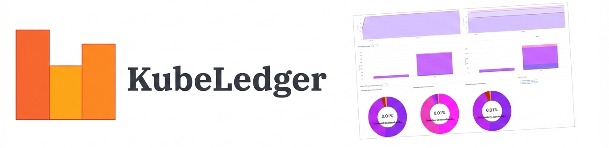

---

- [Overview](#overview)
- [Getting Started](#getting-started)
- [Design Fundamentals](#design-fundamentals)
- [License](#license)
- [Support & Contributions](#support--contributions)

# Overview
`kube-opex-analytics` (literally *Kubernetes Opex Analytics*) is a Kubernetes usage accounting and analytics tool to help organizations track the resources being consumed by their Kubernetes clusters over time (hourly, daily, monthly). The purpose of `kube-opex-analytics` is to help prevent overpaying. Indeed, it provides insightful usage analytics metrics and charts, that engineering and financial teams can use as key indicators to take appropriate cost optimization decisions.

Key features:

* **Hourly consumption trends, daily and monthly accounting per namespace.** This feature provides analytics metrics _tracking both actual usage and requested capacities_ over time. Metrics are namespaced-based, collected every 5 minutes, consolidated on a hourly basis for trends, from which daily and monthly accounting is processed.
* **Accounting of non-allocatable capacities.** At node and cluster levels, `kube-opex-analytics` tracks and consolidates the share of non-allocatable capacities and highlights them against usable capacities (i.e. capacities used by actual application workloads). In contrary to usable capacities, non-allocatable capacities are dedicated to Kubernetes operations (OS, kubelets, etc).
* **Cluster usage accounting and capacity planning.** This feature makes it easy to account and visualize capacities consumed on a cluster, globally, instantly and over time.
* **Usage/requests efficiency.** Based on hourly-consolidated trends, this functionality helps know how efficient resource requests set on Kubernetes workloads are, compared against the actual resource usage over time.
* **Cost allocation and charge back analytics:** automatic processing and visualization of resource usage accounting per namespace on daily and monthly periods.
* **Insightful and extensible visualization.** `kube-opex-analytics` enables built-in analytics dashboards, as well as a native Prometheus exporter that exposes its analytics metrics for third-party visualization tools like Grafana.

Read the [design fundamentals](./docs/design-fundamentals.md) documentation to learn more concepts and implementation decisions.

> **Multi-cluster Integration:** `kube-opex-analytics` tracks the usage for a single Kubernetes cluster. For a centralized multi-Kubernetes usage analytics, use our [Krossboard Kubernetes Operator](https://github.com/2-alchemists/krossboard-kubernetes-operator) product. Watch a [demo video](https://youtu.be/lfkUIREDYDY).

# Getting Started
* [Installation on Kubernetes](./docs/installation-on-kubernetes.md)
* [Installation on Docker](./docs/installation-on-docker.md)
* [Built-in dashboards and charts](./docs/built-in-dashboards-and-charts.md)
* [Prometheus Exporter and Grafana Dashboards](./docs/prometheus-exporter-grafana-dashboard.md)
* [Configuration Settings](./docs/configuration-settings.md)

# Design Fundamentals
Checkout the [Design Fundamentals](./docs/design-fundamentals.md) documentation to learn more about `kube-opex-analytics`, it introduces concepts and implementation decisions.

# License
`kube-opex-analytics` (code and documentation) is licensed under the terms of Apache License 2.0; read the [LICENSE](./LICENSE). Besides, it's bound to third-party libraries each with its specific license terms; read the [NOTICE](./NOTICE) for additional information.

# Support & Contributions
We encourage feedback and always make our best to handle any troubles you may encounter when using `kube-opex-analytics`.

Use this [link to submit issues or improvement ideas](https://github.com/rchakode/kube-opex-analytics/issues).

To contribute bug patches or new features, please submit a [Pull Request](https://github.com/rchakode/kube-opex-analytics/pulls).

Contributions are accepted subject that the code and documentation be released under the terms of Apache 2.0 License.

