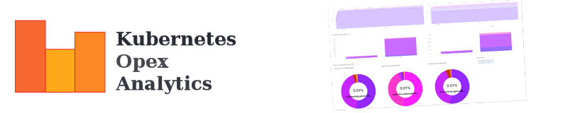

[](http://calver.org)


---

## Table of Contents

- [Overview](#overview)
- [Key Features](#key-features)
- [Quick Start](#quick-start)
- [Architecture](#architecture)
- [Documentation](#documentation)
- [Configuration](#configuration)
- [Troubleshooting](#troubleshooting)
- [License](#license)
- [Support & Contributions](#support--contributions)

## Overview

**kube-opex-analytics** is a Kubernetes usage accounting and analytics tool that helps organizations track **CPU, Memory, and GPU** resources consumed by their clusters over time (hourly, daily, monthly).

It provides insightful usage analytics metrics and charts that engineering and financial teams can use as key indicators for cost optimization decisions.

### Tracked Resources

- **CPU** - Core usage and requests per namespace
- **Memory** - RAM consumption and requests per namespace
- **GPU** - NVIDIA GPU utilization via DCGM integration


> **Multi-cluster Integration:** kube-opex-analytics tracks usage for a single Kubernetes cluster. For centralized multi-cluster analytics, see [Krossboard Kubernetes Operator](https://github.com/2-alchemists/krossboard) ([demo video](https://youtu.be/lfkUIREDYDY)).

## Key Features

| Feature | Description |
|---------|-------------|
| **Hourly/Daily/Monthly Trends** | Tracks actual usage and requested capacities per namespace, collected every 5 minutes and consolidated hourly |
| **Non-allocatable Capacity Tracking** | Highlights system overhead (OS, kubelets) vs. usable application capacity at node and cluster levels |
| **Cluster Capacity Planning** | Visualize consumed capacity globally, instantly, and over time |
| **Usage Efficiency Analysis** | Compare resource requests against actual usage to identify over/under-provisioning |
| **Cost Allocation & Chargeback** | Automatic resource usage accounting per namespace for billing and showback |
| **Prometheus Integration** | Native exporter at `/metrics` for Grafana dashboards and alerting |

## Quick Start

### Prerequisites

- Kubernetes cluster v1.19+ (or OpenShift 4.x+)
- `kubectl` configured with cluster access
- Helm 3.x (fine-tuned installation) or `kubectl` for a basic opinionated deployment
- Cluster permissions: read access to pods, nodes, and namespaces
- **[Kubernetes Metrics Server](https://github.com/kubernetes-sigs/metrics-server)** deployed in your cluster (required for CPU and memory metrics)
- **[NVIDIA DCGM Exporter](https://github.com/NVIDIA/dcgm-exporter)** deployed in your cluster (required for GPU metrics, optional if no GPUs)

### Verify Metrics Server

Before installing, ensure metrics-server is running in your cluster:

```bash
# Check if metrics-server is deployed
kubectl get deployment metrics-server -n kube-system

# Verify it's working
kubectl top nodes

# If not installed, deploy with kubectl
kubectl apply -f https://github.com/kubernetes-sigs/metrics-server/releases/latest/download/components.yaml
```

### Verify DCGM Exporter (GPU metrics)

If your cluster has NVIDIA GPUs and you want GPU metrics, ensure DCGM Exporter is running:

```bash
# Check if DCGM Exporter is deployed
kubectl get daemonset -A | grep dcgm

# If not installed, deploy with Helm (requires NVIDIA GPU Operator or drivers)
helm repo add gpu-helm-charts https://nvidia.github.io/dcgm-exporter/helm-charts
helm install dcgm-exporter gpu-helm-charts/dcgm-exporter \
  --namespace gpu-operator \
  --create-namespace
```

### Clone the Repository

```bash
git clone https://github.com/rchakode/kube-opex-analytics.git --depth=1
cd kube-opex-analytics
```

### Install with Kustomize (Quick Start)

> **OpenShift users:** Skip this section and use [Helm installation](#install-with-helm-advanced) with OpenShift-specific settings.

```bash
# Create namespace
kubectl create namespace kube-opex-analytics

# Deploy using Kustomize
kubectl apply -k ./manifests/kustomize -n kube-opex-analytics

# Watch pod status
kubectl get pods -n kube-opex-analytics -w
```

### Install with Helm (Advanced)

For advanced customization (OpenShift, custom storage, etc.), edit `manifests/helm/values.yaml`:

- **OpenShift:** Set `securityContext.openshift: true`
- **Custom storage:** Set `dataVolume.storageClass` and `dataVolume.capacity`

Then run:

```bash
# Create namespace
kubectl create namespace kube-opex-analytics

# Install with Helm
helm upgrade --install kube-opex-analytics ./manifests/helm \
  -n kube-opex-analytics

# Watch pod status
kubectl get pods -n kube-opex-analytics -w
```

### Access the Dashboard

```bash
# Port-forward to access the UI
kubectl port-forward svc/kube-opex-analytics 5483:80 -n kube-opex-analytics

# Open http://localhost:5483 in your browser
```

### Install with Docker

Requires `kubectl proxy` running locally to provide API access:

```bash
# Start kubectl proxy in background
kubectl proxy &

# Run kube-opex-analytics
docker run -d \
  --net="host" \
  --name kube-opex-analytics \
  -v /var/lib/kube-opex-analytics:/data \
  -e KOA_DB_LOCATION=/data/db \
  -e KOA_K8S_API_ENDPOINT=http://127.0.0.1:8001 \
  rchakode/kube-opex-analytics

# Access at http://localhost:5483
```

## Architecture

```
┌───────────────────┐
│  Metrics Server   │──┐
│  (CPU/Memory)     │  │    ┌──────────────────────────────────────┐
└───────────────────┘  ├───>│         kube-opex-analytics          │
┌───────────────────┐  │    │  ┌─────────┐  ┌───────┐  ┌─────────┐ │
│  DCGM Exporter    │──┘    │  │ Poller  │─>│RRDtool│─>│Flask API│ │
│  (GPU metrics)    │       │  │ (5 min) │  │  DBs  │  │         │ │
└───────────────────┘       │  └─────────┘  └───────┘  └────┬────┘ │
                            └───────────────────────────────┼──────┘
                                                            │
                            ┌───────────────────────────────┼──────┐
                            │                               v      │
                            │  ┌────────────┐    ┌────────────┐    │
                            │  │  Web UI    │    │  /metrics  │    │
                            │  │  (D3.js)   │    │ (Prometheus│    │
                            │  └────────────┘    └────────────┘    │
                            └──────────────────────────────────────┘
                                     │                  │
                                     v                  v
                              Built-in Dashboards   Grafana/Alerting
```

**Data Flow:**
1. Metrics polled every 5 minutes (configurable):
   - CPU/Memory from Kubernetes Metrics Server
   - GPU from NVIDIA DCGM Exporter
2. Metrics are processed and stored in RRDtool time-series databases
3. Data is consolidated into hourly, daily, and monthly aggregates
4. Flask API serves data to the built-in web UI and Prometheus scraper

## Documentation

| Topic | Link |
|-------|------|
| Installation on Kubernetes/OpenShift | [docs/installation-on-kubernetes-and-openshift.md](./docs/installation-on-kubernetes-and-openshift.md) |
| Installation on Docker | [docs/installation-on-docker.md](./docs/installation-on-docker.md) |
| Built-in Dashboards | [docs/built-in-dashboards-and-charts.md](./docs/built-in-dashboards-and-charts.md) |
| Prometheus & Grafana | [docs/prometheus-exporter-grafana-dashboard.md](./docs/prometheus-exporter-grafana-dashboard.md) |
| Configuration Reference | [docs/configuration-settings.md](./docs/configuration-settings.md) |
| Design Fundamentals | [docs/design-fundamentals.md](./docs/design-fundamentals.md) |

## Configuration

Key environment variables:

| Variable | Description | Default |
|----------|-------------|---------|
| `KOA_K8S_API_ENDPOINT` | Kubernetes API server URL | Required |
| `KOA_K8S_AUTH_TOKEN` | Service account token | Auto-detected in-cluster |
| `KOA_DB_LOCATION` | Path for RRDtool databases | `/data` |
| `KOA_POLLING_INTERVAL_SEC` | Metrics collection interval | `300` |
| `KOA_COST_MODEL` | Billing model (`CUMULATIVE_RATIO`, `RATIO`, `CHARGE_BACK`) | `CUMULATIVE_RATIO` |
| `KOA_BILLING_HOURLY_RATE` | Hourly cost for chargeback model | `-1.0` |
| `KOA_BILLING_CURRENCY_SYMBOL` | Currency symbol for cost display | `$` |

See [Configuration Settings](./docs/configuration-settings.md) for the complete reference.

## Troubleshooting

### Common Issues

**Pod stuck in CrashLoopBackOff**
- Check logs: `kubectl logs -f deployment/kube-opex-analytics -n kube-opex-analytics`
- Verify RBAC permissions are correctly applied
- Ensure the service account has read access to pods and nodes

**No data appearing in dashboard**
- Wait at least 5-10 minutes for initial data collection
- Verify the pod can reach the Kubernetes API: check for connection errors in logs
- Confirm `KOA_K8S_API_ENDPOINT` is correctly set

**Metrics not appearing in Prometheus**
- Ensure the `/metrics` endpoint is accessible
- Check ServiceMonitor/PodMonitor configuration if using Prometheus Operator
- Verify network policies allow Prometheus to scrape the pod

**Pooling interval**
- By default, the polling interval to collect raw metrics from Kubernetes API or NVIDIA DCGM is 300 seconds (5 minutes).
- You can increase this limit using the variable `KOA_POLLING_INTERVAL_SEC`. Always use a multiple  300 seconds, as the backend RRD database is based on a 5-minutes resolution.

### Getting Help

- Check existing [GitHub Issues](https://github.com/rchakode/kube-opex-analytics/issues)
- Review the [Design Fundamentals](./docs/design-fundamentals.md) for architectural context

## License

kube-opex-analytics is licensed under [Apache License 2.0](./LICENSE).

Third-party library licenses are documented in [NOTICE](./NOTICE).

## Support & Contributions

We welcome feedback and contributions!

- **Report Issues:** [GitHub Issues](https://github.com/rchakode/kube-opex-analytics/issues)
- **Contribute Code:** [Pull Requests](https://github.com/rchakode/kube-opex-analytics/pulls)

All contributions must be released under Apache 2.0 License terms.
