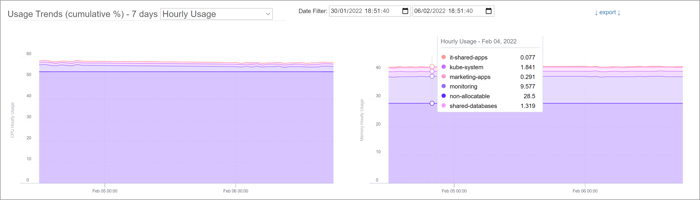
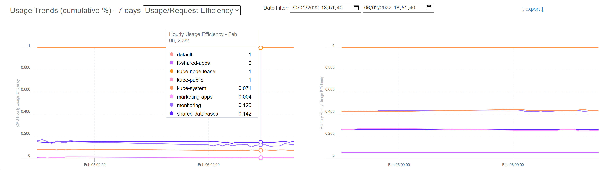

# Built-in Dashboards and Charts of kube-opex-analytics
This section describes the built-in dashboards and charts provided by `kube-opex-analytics`. 

- [Built-in Dashboards and Charts of kube-opex-analytics](#built-in-dashboards-and-charts-of-kube-opex-analytics)
  - [Hourly Consolidated Usage Trends (7 last days)](#hourly-consolidated-usage-trends-7-last-days)
  - [Hourly Usage/Requests Efficiency Trends (7 last days)](#hourly-usagerequests-efficiency-trends-7-last-days)
  - [Daily CPU and Memory Usage (14 last days)](#daily-cpu-and-memory-usage-14-last-days)
  - [Monthly CPU and Memory Usage (12 last months)](#monthly-cpu-and-memory-usage-12-last-months)
  - [Nodes' Occupation by Pods](#nodes-occupation-by-pods)
  - [Export Charts and Datasets (PNG, CSV, JSON)](#export-charts-and-datasets-png-csv-json)
- [Dashboards and Visualization with Grafana](#dashboards-and-visualization-with-grafana)

## Hourly Consolidated Usage Trends (7 last days)
For the different namespaces discovered in the Kubernetes cluster, these charts show hourly usage trends for CPU and memory resources during the last week (7 days).

The date filter can be used to zoom out/in on a specific time range.

## Hourly Usage/Requests Efficiency Trends (7 last days)
For the different namespaces discovered in the Kubernetes cluster, these charts show hourly usage/requests efficiency trends for CPU and memory resources during the last week (7 days).

The date filter can be used to zoom out/in on a specific time range.

## Daily CPU and Memory Usage (14 last days)
For the different namespaces discovered in the Kubernetes cluster, these charts show daily cumulative usage for CPU and memory resources during the last 2 weeks.

## Monthly CPU and Memory Usage (12 last months)
For the different namespaces discovered in the Kubernetes cluster, these charts show monthly cumulative usage for CPU and memory resources during the last 12 months.

## Nodes' Occupation by Pods
For the different nodes discovered in the Kubernetes cluster, these charts show for each node the CPU and the memory resources currently consumed by running pods.

## Export Charts and Datasets (PNG, CSV, JSON)
Any chart provided by kube-opex-analytics can be exported, either as PNG image, CSV or JSON data files.

* Go to the target chart section.
* Click on the link `export`, then select the target exportion format. This action shall download the artifact instantly.

# Dashboards and Visualization with Grafana
In addition or alternatively to the built-in dashboards, it's also possible to [use Grafana for visualization](./prometheus-exporter-grafana-dashboard.md) thanks to the Prometheus exporter natively enabled by `kube-opex-analytics`.