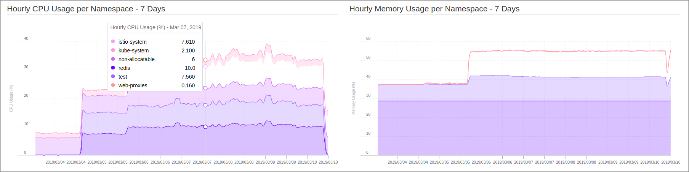
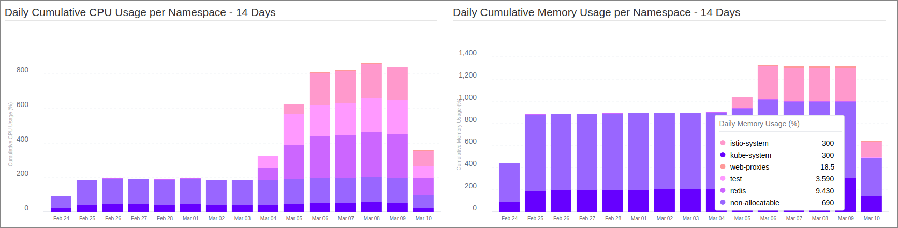
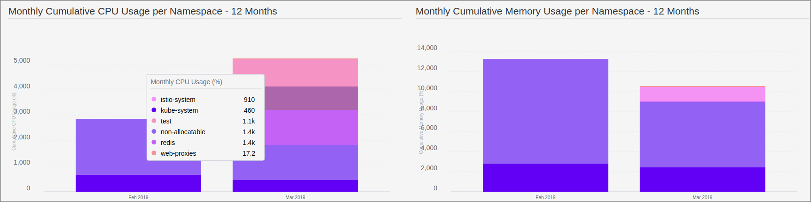
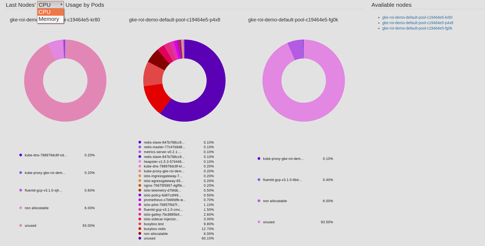
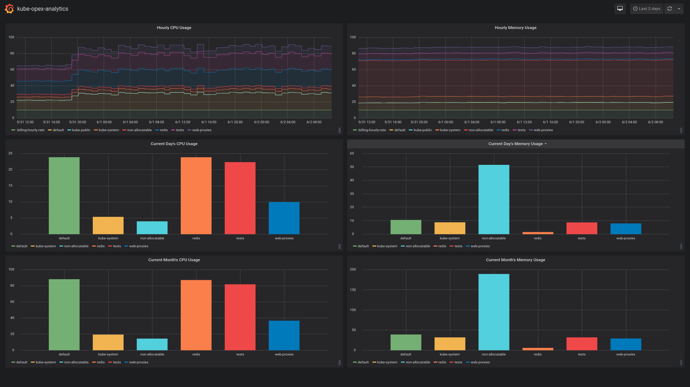
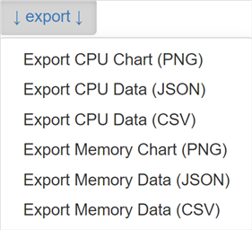

[](https://github.com/rchakode/kube-opex-analytics/actions)


# Table of Contents
- [Overview](#overview)
  - [Goals](#goals)
  - [Concepts](#concepts)
  - [Cost Models](#cost-models)
- [Screenshorts](#screenshorts)
  - [Last Week Hourly Resource Usage Trends](#last-week-hourly-resource-usage-trends)
  - [Two-weeks Daily CPU and Memory Usage](#two-weeks-daily-cpu-and-memory-usage)
  - [One-year Monthly CPU and Memory Usage](#one-year-monthly-cpu-and-memory-usage)
  - [Nodes' Occupation by Pods](#nodes-occupation-by-pods)
  - [Grafana Dashboard](#grafana-dashboard)
- [Getting Started](#getting-started)
  - [Kubernetes API Access](#kubernetes-api-access)
  - [Configuration Variables](#configuration-variables)
  - [Deployment on Docker](#deployment-on-docker)
    - [Get Access to the User Interface](#get-access-to-the-user-interface)
  - [Deployment on a Kubernetes cluster](#deployment-on-a-kubernetes-cluster)
    - [Installation using Helm 2 (i.e. with tiller)](#installation-using-helm-2-ie-with-tiller)
    - [Installation using Helm 3 (i.e. without tiller)](#installation-using-helm-3-ie-without-tiller)
    - [Installation using Kubectl](#installation-using-kubectl)
    - [Get Access to UI Service](#get-access-to-ui-service)
  - [Prometheus Exporter](#prometheus-exporter)
  - [Export Charts and Datasets (PNG, CSV, JSON)](#export-charts-and-datasets-png-csv-json)
- [License & Copyrights](#license--copyrights)
- [Support & Contributions](#support--contributions)

# Overview
<a name="overview"></a>

## Goals
<a name="goals"></a>

`kube-opex-analytics` or literally *Kubernetes Opex Analytics* is a tool to help organizations track the resources being consumed by their Kubernetes clusters to prevent overpaying. To do so it generates, short-, mid- and long-term usage reports showing relevant insights on what amount of resources each project is spending over time. The final **goal being to ease cost allocation and capacity planning decisions** with factual analytics.

Actually, `kube-opex-analytics` periodically collects CPU and memory usage metrics from Kubernetes's APIs, processes and consolidates them over various time-aggregation perspectives (hourly, daily, monthly), to produce resource **usage reports covering up to a year**. The reports focus on namespace level, while a special care is taken to also account and highlight **shares of non-allocatable capacities**.


## Concepts
<a name="concepts"></a>

`kube-opex-analytics` is designed atop the following core concepts and features:

* **Namespace-focused:** Means that consolidated resource usage metrics consider individual namespaces as fundamental units for resource sharing. A special care is taken to also account and highlight `non-allocatable` resources .
* **Hourly Usage & Trends:** Like on public clouds, resource consumption for each namespace is consolidated on a hourly-basic. This actually corresponds to the ratio (%) of resource used per namespace during each hour. It's the foundation for cost calculation and also allows to get over time trends about resources being consuming per namespace and also at the Kubernetes cluster scale.
* **Daily and Monthly Usage Costs:** Provides for each period (daily/monthly), namespace, and resource type (CPU/memory), consolidated cost computed given one of the following ways: (i) accumulated hourly usage over the period; (ii) actual costs computed based on resource usage and a given hourly billing rate; (iii) normalized ratio of usage per namespace compared against the global cluster usage.
* **Occupation of Nodes by Namespaced Pods:** Highlights for each node the share of resources used by active pods labelled by their namespace.
* **Efficient Visualization:** For metrics generated, `kube-opex-analytics` provides dashboards with relevant charts covering as well the last couple of hours than the last 12 months (i.e. year). For this there are **built-in charts**, a **Prometheus Exporter** along with **Grafana Dashboard** that all work out of the box.


## Cost Models
<a name="cost-models"></a>

Cost allocation models can be set through the startup configuration variable `KOA_COST_MODEL`. Possible values are:

* `CUMULATIVE_RATIO`: (default value) compute costs as cumulative resource usage for each period of time (daily, monthly).
* `RATIO`: compute costs as normalized ratios (`%`) of resource usage during each period of time.
* `CHARGE_BACK`: compute actual costs using a given cluster hourly rate and the cumulative resource usage during each period of time.

Read the [Configuration](#configuration-variables) section for more details.

# Screenshorts
<a name="screenshorts"></a>

You can find below screenshorts of built-in charts.

## Last Week Hourly Resource Usage Trends



## Two-weeks Daily CPU and Memory Usage



## One-year Monthly CPU and Memory Usage



## Nodes' Occupation by Pods


## Grafana Dashboard
<a name="grafana-dashboard"></a> 

You can either build your own dashboard or use our [official one](https://grafana.com/dashboards/10282).

Our official Grafana dashboard looks as below and is designed to work out-of-the box with the `kube-opex-analytics`'s [Prometheus exporter](#prometheus-exporter). It requires to set a Grafana varianle named `KOA_DS_PROMETHEUS`, which shall point to your Prometheus server data source.

The dashboard currently provides the following reports:

* Hourly resource usage over time.
* Current day's ongoing resource usage.
* Current month's ongoing resource usage.

> You should notice those reports are less rich compared against the ones enabled by the built-in `kube-opex-analytics` dashboard. In particular, the daily and the monthly usage for the different namespaces are not stacked, neither than there are not analytics for past days and months. These limitations are inherent to how Grafana handles timeseries and bar charts.




# Getting Started
<a name="getting-started"></a>

## Kubernetes API Access
<a name="kubernetes-api-access"></a>

`kube-opex-analytics` needs read-only access to the following Kubernetes APIs.

* /apis/metrics.k8s.io/v1beta1
* /api/v1

You need to provide the base URL of the Kubernetes API when starting the program (see example below).

Typically if you're planning an installation inside a Kubernetes cluster, you can connect to the local cluster API endpoint at: `https://kubernetes.default`.

Likewise, if you're planning an installation outside a Kubernetes cluster you can use a proxied access to Kubernetes API as follows:

```
$ kubectl proxy
```

This will open a proxied access to Kubernetes API at `http://127.0.0.1:8001`.

## Configuration Variables
<a name="configuration-variables"></a>

`kube-opex-analytics` supports the following environment variables when it starts:
* `KOA_DB_LOCATION` sets the path to use to store internal data. Typically when you consider to set a volume to store those data, you should also take care to set this path to belong to the mounting point.
* `KOA_K8S_API_ENDPOINT` sets the endpoint to the Kubernetes API.
* `KOA_COST_MODEL` (version >= `0.2.0`): sets the model of cost allocation to use. Possible values are: _CUMULATIVE_RATIO_ (default) indicates to compute cost as cumulative resource usage for each period of time (daily, monthly); _CHARGE_BACK_ calculates cost based on a given cluster hourly rate (see `KOA_BILLING_HOURLY_RATE`); _RATIO_ indicates to compute cost as a normalized percentage of resource usage during each period of time.
* `KOA_BILLING_HOURLY_RATE` (required if cost model is _CHARGE_BACK_): defines a positive floating number corresponding to an estimated hourly rate for the Kubernetes cluster. For example if your cluster cost is $5,000 dollars a month (i.e. `~30*24` hours), its estimated hourly cost would be `6.95 = 5000/(30*24)`.
* `KOA_BILLING_CURRENCY_SYMBOL` (optional, default is '`$`'): sets a currency string to use to annotate costs on reports.


## Deployment on Docker
<a name="deployment-on-docker"></a>

`kube-opex-analytics` is released as a Docker image. So you can quickly start an instance of the service by running the following command:

```
$ docker run -d \
        --net="host" \
        --name 'kube-opex-analytics' \
        -v /var/lib/kube-opex-analytics:/data \
        -e KOA_DB_LOCATION=/data/db \
        -e KOA_K8S_API_ENDPOINT=http://127.0.0.1:8001 \
        rchakode/kube-opex-analytics
```

In this command:

 * We provide a local path `/var/lib/kube-opex-analytics` as data volume for the container. That's where `kube-opex-analytics` will store its internal analytics data. You can change this local path to another location, but please keep the container volume `/data` as is.
 * The environment variable `KOA_DB_LOCATION` points to the container path to store data. You may note that this directory belongs to the data volume atached to the container.
 * The environment variable `KOA_K8S_API_ENDPOINT` set the address of the Kubernetes API endpoint.

### Get Access to the User Interface
<a name="get-access-to-the-user-interface"></a>

 Once the container started you can open access the `kube-opex-analytics`'s web interface at `http://<DOCKER_HOST>:5483/`. Where `<DOCKER_HOST>` should be replaced by the IP address or the hostmane of the Docker server.

For instance, if you're running Docker on your local machine the interface will be available at: `http://127.0.0.1:5483/`

 > Due to the time needed to have sufficient data to consolidate, you may need to wait almost a hour to have all charts filled. This is a normal operations of `kube-opex-analytics`.

## Deployment on a Kubernetes cluster
<a name="deployment-on-a-kubernetes-cluster"></a>

There is a [Helm chart](./helm/) to ease the deployment on Kubernetes using, either `Helm 2` (i.e with [`Tiller`](https://v2.helm.sh/docs/install/)), Helm 3 (without `Tiller`) or `kubectl`.

In each of the cases, check the [values.yaml](./helm/kube-opex-analytics/values.yaml) file to customize the configuration options according to your specific requirements. 

In particular, you may need to customize the default settings used for the persistent data volume, the Prometheus Operator and its ServiceMonitor, the security context, and many others.

> **Note on the Security Context:**
> Prior to version `0.4.2` `kube-opex-analytics`'s pods were deployed in privileged mode, meaning that the container program was executed as `root`. That was causing some warnings to be prompted during the startup (e.g. issue #15). Even worse, on Kubernetes clusters with strong security policies the execution of the container was prevented. Starting from version `0.4.2` Security Context settings have been introduced to configure the pod to be launched in unprivileged mode by default. However, for backward compatibility, it's still possible to launch the pod in privileged mode by setting the Helm configuration value `securityContext.enabled` to `false`.

In the next deployment commands, it's assumed that the target namespace `kube-opex-analytics` exists. You thus need to create it first or, alternatively, adapt the commands to use any other namespace of your choice.

### Installation using Helm 2 (i.e. with tiller)
<a name="installation-using-helm-2-ie-with-tiller"></a>

Helm 2 requires to have [`tiller`](https://v2.helm.sh/docs/install/) installed on the cluster.

```bash
helm upgrade \
  --namespace kube-opex-analytics \
  --install kube-opex-analytics \
  helm/kube-opex-analytics/
```

### Installation using Helm 3 (i.e. without tiller)
<a name="installation-using-helm-3-ie-without-tiller"></a>

Helm 3 does not longer require to have [`tiller`](https://v2.helm.sh/docs/install/).

As a consequence the below command shall work with a fresh installation of `kube-opex-analytics` or a former version installed with Helm 3. There is a [known issue](https://github.com/helm/helm/issues/6850) when there is already a version not installed Helm 3.

```bash
helm upgrade \
  --namespace kube-opex-analytics \
  --install kube-opex-analytics \
  helm/kube-opex-analytics/
```

### Installation using Kubectl
<a name="installation-using-kubectl"></a>
This approach requires to have the Helm client (version 2 or 3) installed to generate a raw template for kubectl.

```
$ helm template \
  --namespace kube-opex-analytics \
  --name kube-opex-analytics \
  helm/kube-opex-analytics/ | kubectl apply -f -
```

### Get Access to UI Service
<a name="get-access-to-ui-service"></a>

The Helm deploys an HTTP service named `kube-opex-analytics` on port `80` in the selected namespace, providing to the built-in dashboard of `kube-opex-analytics`.

## Prometheus Exporter
<a name="prometheus-exporter"></a>

Starting from version `0.3.0`, `kube-opex-analytics` enables a Prometheus exporter through the endpoint `/metrics`.

The exporter exposes the following metrics:

* `koa_namespace_hourly_usage` exposes for each namespace its current hourly resource usage for both CPU and memory.
* `koa_namespace_daily_usage` exposes for each namespace and for the ongoing day, its current resource usage for both CPU and memory.
* `koa_namespace_monthly_usage` exposes for each namespace and for the ongoing month, its current resource usage for both CPU and memory.

The Prometheus scraping job can be configured like below (adapt the target URL if needed). A scraping interval less than 5 minutes (i.e. `300s`) is useless as `kube-opex-analytics` would not generate any new metrics in the meantime.


```
scrape_configs:
  - job_name: 'kube-opex-analytics'
    scrape_interval: 300s
    static_configs:
      - targets: ['kube-opex-analytics:5483']
```

> When the option `prometheusOperator` is enabled during the deployment (see Helm [values.yaml](./helm/kube-opex-analytics/values.yaml) file), you have nothing to do as the scraping should be automatically configured by the deployed `Prometheus ServiceMonitor`.


## Export Charts and Datasets (PNG, CSV, JSON)
<a name="export-charts-and-datasets-png-csv-json"></a>

Any chart provided by kube-opex-analytics can be exported, either as PNG image, CSV or JSON data files.

The exportation steps are the following:

* Get access to kube-opex-analytics's interface.
* Go to the chart that you want to export dataset.
* Click on the `tricolon` icon near the chart title, then select the desired export format.
 
  

* You're done, the last step shall download the result file instantly.

# License & Copyrights
<a name="license--copyrights"></a>

This tool (code and documentation) is licensed under the terms of Apache License 2.0. Read the `LICENSE` file for more details on the license terms.

The tool includes and is bound to third-party libraries provided with their owns licenses and copyrights. Read the `NOTICE` file for additional information.

# Support & Contributions
<a name="support--contributions"></a>

We encourage feedback and always make our best to handle any troubles you may encounter when using this tool.

Here is the link to submit issues: https://github.com/rchakode/kube-opex-analytics/issues.

New ideas are welcomed, please open an issue to submit your idea if you have any one.

Contributions are accepted subject that the code and documentation be released under the terms of Apache 2.0 License.

To contribute bug patches or new features, you can use the Github Pull Request model.
